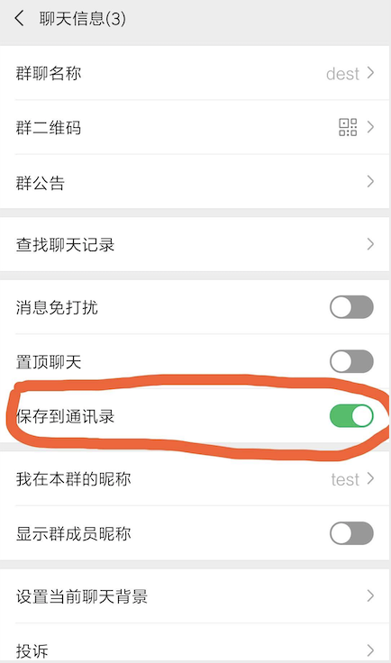
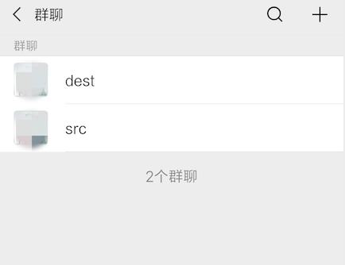
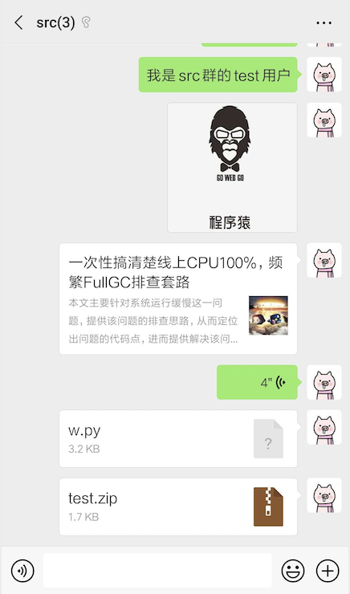
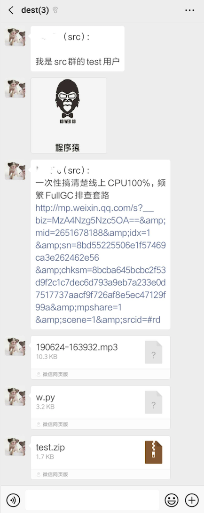

## WechatGroup
WechatGroup可以实现监控某个群组信息，实时发送被监控群消息到指定群组中，支持文字、分享、图片、语音等转发功能

### 1、安装环境

```
pip install itchat
```

### 2、文件说明

**wechat.ini** 配置文件

```
[rooms]
src_room=src		# 被监控群
dest_room=dest		# 发送到指定群
```

**WechaGroup.py** 执行脚本，实时监控群消息并转发

```
python WechatGroup.py
```

### 3、使用帮助

#### 3.1 加入通讯录
把要监听的群以及接收的群加入到微信通讯录，如下图所示：(**注意：两个群都加**)  





#### 3.2 执行脚本

```
python WechatGroup.py
```
**扫描二维码确认登录**

#### 3.3 实现效果
**被监听群（src）:**  
  

**接收群（dest）:**  
  